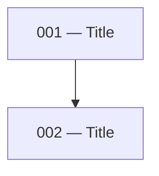

# Plan or Spec to Issues

## Input

You will be given one of:

- A **local plan or spec file** — a markdown file on disk, typically produced by the `create-technical-spec` skill
- A **GitHub issue** — referenced by URL or issue number on the current repo, typically produced by the `create-technical-spec` skill in issue mode

Read the source document thoroughly before doing anything else (fetch via `gh issue view <num> --json title,body -q .body` if it's an issue).

## Output Modes

The skill has two modes:

- **Local mode** (default for local file inputs) — generates dependency-ordered markdown files under `docs/issues/<feature-slug>/`. Best for specs that live locally and aren't tracked on GitHub.
- **Online mode** (default for GitHub issue inputs) — creates GitHub sub-issues of the parent spec issue with native blocking dependencies. No local files are written. Best when the spec is already an issue so cloud sessions and collaborators can work from it.

### Mode detection

- Input is a **GitHub issue URL or number** → online mode
- Input is a **local file path** → local mode
- **Explicit override tokens**: `--online` / `--sub-issues` force online mode; `--local` forces local mode. For online mode on a local file, the file must contain a `<!-- github-issue: #N ... -->` stamp identifying the parent issue, or the user must supply the parent issue reference.
- **Phrases** also work: "as sub-issues", "create GitHub sub-issues", "keep local", etc.

---

## Proposal & Approval (required before any writes)

After decomposing the spec (Step 2 in either mode) and **before writing any files or creating any GitHub issues**, present the proposed decomposition to the user and wait for explicit approval.

The proposal must include, for each planned issue:
- Its number (or dependency position) and title
- A one-sentence summary
- Its blockers (by number/title)
- The key files or components it will touch

Also surface:
- The dependency order across the set (a short list or mini graph is fine)
- Any scope items from the source spec you are deliberately excluding, and why
- The mode that will be used (Local or Online) and, for Online, the parent issue

Wait for the user to say "approved", "go ahead", "looks good", "proceed", or to send revisions. If they request changes, update the decomposition and re-propose. Do not skip this step even if the decomposition seems obvious — creating issues or files prematurely is costly to undo (especially on GitHub).

---

## Local Mode

### Step 1 — Identify the output directory

Check whether an issues directory already exists for this feature:

- Look for `docs/issues/<feature-slug>/` relative to the project root
- If it exists, read the existing files to understand numbering already in use
- If it does not exist, you will create it

Ask the user for the feature slug if it is not obvious from the plan or spec.

### Step 2 — Decompose into issues

Break the plan or spec into discrete, independently implementable units of work. Each issue should:

- Represent a single coherent piece of the system (a service, a schema group, a controller, a handler, etc.)
- Be small enough to implement in one focused session
- Have clearly definable inputs (blockers) and outputs (what it unblocks)

Identify the dependency order across all issues before writing any files. Schema and data layer issues come before service issues; service issues come before controller and handler issues.

### Step 3 — Write the issue files

> **Gate:** Only proceed once the user has approved the proposal (see [Proposal & Approval](#proposal--approval-required-before-any-writes)).

**The implementer will read the spec.** Issue files exist to carve out a clear boundary — not to rewrite the source document. Keep every section as short as possible. If something is already explained in the spec, point to it; do not repeat it.

For each issue, create a file at:

```
docs/issues/<feature-slug>/NNN-<slug>.md
```

Where `NNN` is a zero-padded three-digit number starting from `001`, ordered by dependency (earliest dependencies first).

Each file must follow this structure exactly:

````markdown
# NNN — <Title>

## Plan reference

[<Plan or Spec title>](<relative path to source document>) — <relevant sections>

## Summary

<One sentence naming what this issue builds.>

## Blockers

- **Issue NNN** — <specific methods, schemas, or exports that must exist before this issue can start>

_(omit this section if there are no blockers)_

## Scope

<Concise breakdown of what to implement. Use short bullet points per file or component — name the method, field, or route and state what it does in one line. Do not reproduce content already in the spec; point to the relevant section instead. The implementer will read the spec. This section exists to draw a clear boundary around the issue, not rewrite the source document.>

## Files to create/modify

**New:**
- `<path>`

**Modified:**
- `<path>` — <what changes>

_(omit a category if empty)_

## Unblocks

- Issue NNN (<Title>) — <what this issue provides that unblocks it>

_(omit this section if this issue unblocks nothing)_
````

### Step 4 — Verify the set

Before finishing, check across all issues:

- Every blocker reference points to a real issue in the set
- Every unblocks reference points to a real issue in the set
- No issue is both a blocker and unblocked by the same issue (circular dependency)
- The numbering order matches the dependency order — if issue 003 blocks issue 001, renumber
- No scope items are duplicated across issues

### Step 5 — Generate the README

Create `docs/issues/<feature-slug>/README.md` with the following sections in order.

#### Summary table

| File | Title | Level |
|------|-------|-------|
| `NNN-<slug>.md` | Title | 1 |

Level is the dependency depth: issues with no blockers are level 1, issues that only depend on level-1 issues are level 2, and so on.

#### Mermaid dependency map

Build a directed graph from the blocker/unblocks relationships across all issues:

````markdown

````

Each node is `NNN["NNN — Title"]`. Each edge goes from blocker to dependent (`blocker --> dependent`). Issues with no edges still appear as isolated nodes.

#### Parallel levels table

Group issues by their level. For each level, write a natural-language note describing when to start and whether issues in that level can be worked in parallel:

| Level | Issues | Notes |
|-------|--------|-------|
| 1 | 001, 002 | No dependencies. Both can be opened in separate worktrees and worked simultaneously. |
| 2 | 003 | Start after 001 and 002 are merged. |
| 3 | 004, 005 | Both unblocked by 003. Can be picked up in parallel worktrees once 003 is merged. |

#### Picking up an issue

```markdown
## Picking up an issue

1. Verify all blockers for the issue are merged — do not start against unmerged dependency branches
2. Set up an isolated worktree using the `setup-worktree` skill
3. Implement using the `implement-spec` skill — this commits and raises a PR automatically
```

### Step 6 — Report

List all issues created with their titles and a one-line description. Flag any scope items from the source plan that were deliberately excluded and why.

---

## Online Mode

No local files are written. GitHub's native sub-issue and issue-dependency relationships replace the numbered files, README, and mermaid map — the parent issue page will render the hierarchy and blockers directly.

### Step 1 — Resolve the parent issue

- If the input is an issue URL or number, that's the parent.
- If the input is a local file with a `<!-- github-issue: #N https://github.com/<owner>/<repo>/issues/N -->` stamp, use that as the parent.
- Fetch the spec body: `gh issue view <parent> --json body -q .body` (or read from the local file).

### Step 2 — Decompose into issues

Same analysis as local mode Step 2. Identify discrete units of work and their dependency order before creating anything on GitHub. Do this work in memory — do not write scratch files.

### Step 3 — Create sub-issues in dependency order

> **Gate:** Only proceed once the user has approved the proposal (see [Proposal & Approval](#proposal--approval-required-before-any-writes)). This is especially important in online mode — created GitHub issues can't be cleanly undone, only closed.

For each decomposed issue, in dependency order (earliest dependencies first):

1.  Write the issue body to `/tmp/subissue-<slug>-<timestamp>.md`. `/tmp` is self-cleaning on reboot.
2.  Create the issue:
    ```bash
    gh issue create --title "<Title>" --body-file /tmp/subissue-<slug>-<timestamp>.md
    ```
    Capture the new issue's number and node ID. Get the ID via:
    ```bash
    gh api "/repos/<owner>/<repo>/issues/<number>" --jq .id
    ```
3.  Attach as a sub-issue of the parent using the GitHub Sub-Issues API:
    ```bash
    gh api -X POST "/repos/<owner>/<repo>/issues/<parent>/sub_issues" -F sub_issue_id=<child_id>
    ```
4.  For each blocker (a previously created sub-issue this one depends on), add a blocking relationship using the GitHub Issue Dependencies API. Use `gh api` with the current dependencies endpoint (the agent should verify exact syntax against GitHub's docs at the time of execution; the relationship is "this issue is blocked by <blocker>"). If the API call fails, fall back to adding a `Blocked by #N` line in the issue body so the relationship is at least human-readable.

### Step 4 — Issue body structure

Keep sub-issue bodies minimal — GitHub renders the parent link and blocking relationships natively, so duplicating them in the body is noise.

```markdown
## Parent spec

#<parent-number>

## Summary

<One sentence naming what this issue builds.>

## Scope

<Concise bullet points per file or component — name the method, field, or route and state what it does in one line. Point to the relevant section of the parent spec rather than repeating it.>

## Files to create/modify

**New:**
- `<path>`

**Modified:**
- `<path>` — <what changes>

_(omit a category if empty)_
```

Do not include a "Blockers" or "Unblocks" section — GitHub's dependency graph on the parent and on each sub-issue shows this.

### Step 5 — Verify

After all sub-issues are created:

- Each sub-issue appears under the parent's "Sub-issues" list (check via `gh api "/repos/<owner>/<repo>/issues/<parent>/sub_issues"`).
- Each blocking relationship renders on the dependent issue's page.
- No circular dependencies (if the dependencies API accepted a cycle, revisit the decomposition).

### Step 6 — Report

Report back with:
- Parent issue URL
- A bullet list of created sub-issues (number, title, URL, blockers)
- Any scope items from the source spec that were deliberately excluded and why

Do not instruct the user to look at local files — there are none.
