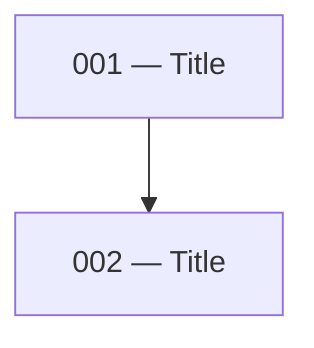

# Plan or Spec to Issues

## Input

You will be given one of:

- A **plan file** — a structured implementation plan, typically produced by the `create-technical-spec` skill
- A **spec file** — a technical specification describing a feature or system

Read the source document thoroughly before doing anything else.

## Step 1 — Identify the output directory

Check whether an issues directory already exists for this feature:

- Look for `docs/issues/<feature-slug>/` relative to the project root
- If it exists, read the existing files to understand numbering already in use
- If it does not exist, you will create it

Ask the user for the feature slug if it is not obvious from the plan or spec.

## Step 2 — Decompose into issues

Break the plan or spec into discrete, independently implementable units of work. Each issue should:

- Represent a single coherent piece of the system (a service, a schema group, a controller, a handler, etc.)
- Be small enough to implement in one focused session
- Have clearly definable inputs (blockers) and outputs (what it unblocks)

Identify the dependency order across all issues before writing any files. Schema and data layer issues come before service issues; service issues come before controller and handler issues.

## Step 3 — Write the issue files

For each issue, create a file at:

```
docs/issues/<feature-slug>/NNN-<slug>.md
```

Where `NNN` is a zero-padded three-digit number starting from `001`, ordered by dependency (earliest dependencies first).

Each file must follow this structure exactly:

````markdown
# NNN — <Title>

## Plan reference

[<Plan or Spec title>](<relative path to source document>) — <relevant sections>

## Summary

<One paragraph describing what this issue builds and why it matters in the context of the overall system.>

## Blockers

- **Issue NNN** — <specific methods, schemas, or exports that must exist before this issue can start>

_(omit this section if there are no blockers)_

## Scope

<Detailed breakdown of everything to implement. Use subsections per file or component. List method signatures, route tables, field definitions, and behaviour notes. Be specific enough that an engineer can implement without reading the source plan.>

## Files to create/modify

**New:**
- `<path>`

**Modified:**
- `<path>` — <what changes>

_(omit a category if empty)_

## Unblocks

- Issue NNN (<Title>) — <what this issue provides that unblocks it>

_(omit this section if this issue unblocks nothing)_
````

## Step 4 — Verify the set

Before finishing, check across all issues:

- Every blocker reference points to a real issue in the set
- Every unblocks reference points to a real issue in the set
- No issue is both a blocker and unblocked by the same issue (circular dependency)
- The numbering order matches the dependency order — if issue 003 blocks issue 001, renumber
- No scope items are duplicated across issues

## Step 5 — Generate the README

Create `docs/issues/<feature-slug>/README.md` with the following sections in order.

### Summary table

| File | Title | Level |
|------|-------|-------|
| `NNN-<slug>.md` | Title | 1 |

Level is the dependency depth: issues with no blockers are level 1, issues that only depend on level-1 issues are level 2, and so on.

### Mermaid dependency map

Build a directed graph from the blocker/unblocks relationships across all issues:

````markdown

````

Each node is `NNN["NNN — Title"]`. Each edge goes from blocker to dependent (`blocker --> dependent`). Issues with no edges still appear as isolated nodes.

### Parallel levels table

Group issues by their level. For each level, write a natural-language note describing when to start and whether issues in that level can be worked in parallel:

| Level | Issues | Notes |
|-------|--------|-------|
| 1 | 001, 002 | No dependencies. Both can be opened in separate worktrees and worked simultaneously. |
| 2 | 003 | Start after 001 and 002 are merged. |
| 3 | 004, 005 | Both unblocked by 003. Can be picked up in parallel worktrees once 003 is merged. |

### Picking up an issue

```markdown
## Picking up an issue

1. Verify all blockers for the issue are merged — do not start against unmerged dependency branches
2. Set up an isolated worktree using the `setup-worktree` skill
3. Implement using the `implement-spec` skill — this commits and raises a PR automatically
```

## Step 6 — Report

List all issues created with their titles and a one-line description. Flag any scope items from the source plan that were deliberately excluded and why.
